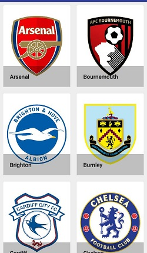
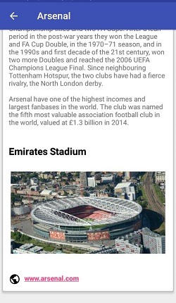

# FooballApp-AndroidMVP
This App show you list and information about FootballTeam of PremierLeague

## Screenshoot
      

# this app used
* Pattern MVP ( Model View Presenter) and Repository Pattern
* Retrofit
* Room
* API -> [API FootballTeam](https://www.thesportsdb.com/api/v1/json/1/search_all_teams.php?l=English%20Premier%20League)
